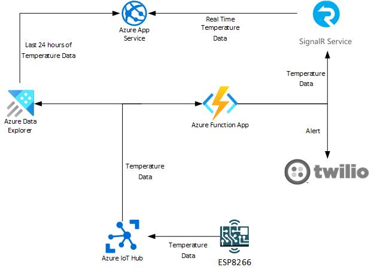

# Create Hot, Warm, and Cold data paths using Azure IoT Hub, App Service, Functions, SignalR, and Data Explorer

 1. [Overview](#overview)
 1. [Scenario](#scenario)
 1. [Contents](#contents)
 1. [Prerequisites](#prerequisites)
 2. [Setup](#setup)
 3. [About the code](#about-the-code)
 4. [Community Help and Support](#community-help-and-support)
 5. [Contributing](#contributing)

## Overview
This sample demonstrates how to create Hot, Warm, and Cold data paths using [Azure IoT Hub](https://docs.microsoft.com/en-us/azure/iot-hub/about-iot-hub) or [IoT Edge (version 1.1)](https://docs.microsoft.com/en-us/azure/iot-edge/about-iot-edge?view=iotedge-2018-06), [App Service](https://docs.microsoft.com/en-us/azure/app-service/), [Functions](https://docs.microsoft.com/en-us/azure/azure-functions/), [SignalR](https://docs.microsoft.com/en-us/azure/azure-signalr/signalr-overview), and [Data Explorer](https://docs.microsoft.com/en-us/azure/data-explorer/).

## Scenario

1. The ESP8226 connects either directly to an Azure IoT Hub or IoT Edge enabled gateway and submits temperature data produced by a DHT11 sensor.
2. This temperature data is then ingested from Azure IoT Hub to an Azure Function and Data explorer.
3. The Azure Data Explorer instance ingests all temperature data for long-term storage
4. The Azure Function broadcasts all temperature data to an Azure SignalR instance
   1. This Azure Function also sends out a text alert if the temperature data starts to fall below a certain threshold
5. The Azure SignalR instance broadcasts temperature data to all clients listening on a WebSocket based connection
6. The App Service hosts an ASP.NET MVC, .NET 5 based, web app that displays the last 24 hours worth of temperature data from Azure Data Explorer
   1. This web app also creates a WebSock connection to the Azure SignalR instance to receive temperature data in real time as well

</br>



</br>

## Contents

| File/folder       | Description                                |
|-------------------|--------------------------------------------|
| `IotFunctionApp/`| The Azure Function App that submits all temperature data to SignalR & alerts if the temperature data is below a certain threshold.|
| `IoTHub-TempSensor/`| The ESP8226 device code for connecting and sending temperature data to either Azure IoT Hub or IoT Edge.|
| `IoTWebApp/`| The web app for the Azure App Service that displays the last 24 hours worth of temperature data store in Data Explorer and all temperature data sent through the SignalR instance.|
| `CODE_OF_CONDUCT.md` | Guidelines for contributing to the sample. |
| `CONTRIBUTING.md` | Guidelines for contributing to the sample. |
| `LICENSE`         | The license for the sample.                |

## Prerequisites

The below prerequisites are required for local development:

- [Python 3.8](https://www.python.org/downloads/)
- [Arduino IDE 1.8.13](https://www.arduino.cc/en/software)
- ESP8266
- DHT11 Sensor
- [Visual Studio Code](https://code.visualstudio.com/download)
- [Visual Studio](https://visualstudio.microsoft.com/downloads/)
  - This prerequisite is only needed if you are not comfortable using Visual Studio Code for C# or ASP.NET MVC development
  - Ensure at least version [.NET 5.0](https://dotnet.microsoft.com/download/dotnet/5.0) has been installed as well
- [Azure Function Core Tools](https://docs.microsoft.com/en-us/azure/azure-functions/functions-run-local?tabs=linux%2Ccsharp%2Cbash)
- [Azure Data Explorer (ADX)](https://docs.microsoft.com/en-us/azure/data-explorer/create-cluster-database-portal)
- [Azure IoT Hub](https://docs.microsoft.com/en-us/azure/iot-hub/iot-hub-create-through-portal)
- [Azure SignalR](https://docs.microsoft.com/en-us/azure/azure-signalr/signalr-quickstart-azure-functions-csharp#create-an-azure-signalr-service-instance)
  - Ensure the <strong>ServiceMode</strong> setting for this resource is set to <strong>Serverless</strong>
- Azure Active Directory (AAD)
  - Specifically, you will need enough acces to create and modify an App Registration for local development use with Azure Data Explorer
- [Twilio Account] (https://www.twilio.com/try-twilio)
  - Only the <strong>Free</strong> version of this service is required for running this sample

The below prerequisites are only needed for production use in Azure:

- [Azure App Service for .NET 5](https://docs.microsoft.com/en-us/azure/app-service/quickstart-dotnetcore?tabs=net50&pivots=development-environment-vs#create-an-aspnet-web-app)
- [Python based Azure Function App](https://docs.microsoft.com/en-us/azure/azure-functions/functions-create-function-app-portal)
- [Azure Key Vault](https://docs.microsoft.com/en-us/azure/key-vault/general/quick-create-portal)

## Setup

### Step 1: Clone or download this repository

From your shell or command line:

```console
    git clone https://github.com/niswitze/Hot-Warm-Cold-On-Azure-IoT.git
```

or download and extract the repository .zip file.

> :warning: To avoid path length limitations on Windows, we recommend cloning into a directory near the root of your drive.

### Step 2: Configure Azure Resources

- #### Azure IoT Hub
    1. After creating an IoT Hub instance, create two [consumer groups](https://github.com/MicrosoftDocs/azure-docs/blob/master/includes/iot-hub-get-started-create-consumer-group.md)
       - A seperate consumer group must be created for the Azure Function and Azure Data Explorer services
- #### Azure Data Explorer 
    1. After creating an Azure Data Explorer instance, create a data connection to the Azure IoT Hub instance
       - The following [public documentation](https://docs.microsoft.com/en-us/azure/data-explorer/ingest-data-iot-hub) is a walk through of how to create an Azure IoT Hub data connection in Data Explorer
       - For this sample, the following KQL statements should be used for creating the table and data mapping 
        ```Shell
        .create table TemperatureData (DeviceId: string, Temperature: real, TelemetryType: string, EnqueuedTime:datetime)

        .create table TemperatureData ingestion json mapping 'TemperatureDataMapping' 
        '[{"column":"DeviceId","path":"$.deviceId","datatype":"string"},{"column":"Temperature","path":"$.temperature","datatype":"real"},{"column":"TelemetryType","path":"$.telemetryType","datatype":"string"},{"column":"EnqueuedTime","path":"$.iothub-enqueuedtime","datatype":"datetime"}]'
        ```
       - When creating the data connection in Azure Data Explorer, ensure the property <strong>iothub-enqueuedtime</strong> has been selected from the <strong>Event system properties</strong> dropdown
     1. For local development, an App Registration needs to be created in Azure Active Directory and given access to the Data Explorer instance
        - The following [public documentation](https://docs.microsoft.com/en-us/azure/data-explorer/provision-azure-ad-app) is a walk through of how to create an App Registration in Azure Active Directory and assign it access to the Data Explorer instance
  
- #### Azure SignalR
    1. For local development, there is no configuration that needs to take place after creating the Azure SignalR instance. However, during creation ensure  the <strong>ServiceMode</strong> setting for this resource is set to <strong>Serverless</strong>
### Step 3: Configure Applications

- #### IoTFunctionApp
  1. Open Visual Studio Code and install the [Python](https://marketplace.visualstudio.com/items?itemName=ms-python.python) and [Azure Functions](https://marketplace.visualstudio.com/items?itemName=ms-azuretools.vscode-azurefunctions) extensions 
  2. Create a virtual environment in the IoTFunctionApp directory using Python's venv module
   ```Shell
   cd IoTFunctionApp
   python3 -m venv venv # only required if you don't have a venv already
   ```
  3. Rename the file local.development.settings.json to local.settings.json
  4. Update the following settings in local.settings.json
         <table>
         <thead>
         <tr>
         <th>Setting Name</th>
         <th>Value</th>
         </tr>
         </thead>
         <tbody>
         <tr>
             <td>AzureWebJobsStorage</td>
             <td>Connection string to an Azure Storage account. For local development, please use either the [Azure Storage Emulator](https://docs.microsoft.com/en-us/azure/storage/common/storage-use-emulator) or [Azurite](https://docs.microsoft.com/en-us/azure/storage/common/storage-use-azurite#install-and-run-the-azurite-visual-studio-code-extension) and set this value to <strong>UseDevelopmentStorage=true</strong></td>
           </tr>
           <tr>
             <td>AzureSignalRHubName</td>
             <td>Hub name of the Azure SignaR instance</td>
           </tr>
           <tr>
             <td>AzureSignalRConnectionString</td>
             <td>Connection string of the Azure SignaR instance</td>
           </tr>
           <tr>
             <td>AzureIoTHubName</td>
             <td>Hub name of the Azure IoTHub instance</td>
           </tr>
           <tr>
             <td>AzureIoTHubConnectionString</td>
             <td>Connection string of the Azure IoTHub instance</td>
           </tr>
           <tr>
             <td>ConsumerGroup</td>
             <td>Name of the dedicated consumer group in the Azure IoTHub instance</td>
           </tr>
           <tr>
             <td>TwilioPhoneNumber</td>
             <td>Phone number created by twilio</td>
           </tr>
           <tr>
             <td>TwilioAccountSid</td>
             <td>Account SID for Twilio account</td>
           </tr>
           <tr>
             <td>TwilioAuthToken</td>
             <td>Authentication token for Twilio account</td>
           </tr>
           <tr>
             <td>OnCallPhoneNumber</td>
             <td>Phone number to send alerts to - Format should be -> (AREACODE) 888 8888</td>
           </tr>
           <tr>
             <td>SendEventUri</td>
             <td>URI of the HttpTriggerDurable function. Only FUNCTIONAPPNAME and FUNCTIONAPPKEY should be updated with the name of the Azure Function App instance and its primary authorization key. These values can also be updated to their localHost versions for local development.</td>
           </tr>
           <tr>
             <td>StartOrchestrationUri</td>
             <td>URI of the HttpTriggerDurable function. Only FUNCTIONAPPNAME and FUNCTIONAPPKEY should be updated with the name of the Azure Function App instance and its primary authorization key. These values can also be updated to their localHost versions for local development.</td>
           </tr>
           <tr>
             <td>OrchestratioStatusnUri</td>
             <td>URI of the event (orchestration) status API, hosted by the Azure Durable Functions framework. Only FUNCTIONAPPNAME, FUNCTIONAPPKEY, and durabletask_extension_key should be updated with the name of the Azure Function App instance, its primary authorization key, and its durabletask_extension key. These values can also be updated to their localHost versions for local development.</td>
           </tr>
         </tbody>
         </table>
- #### IoTWebApp
    1. Open the IoTWebApp.sln file using Visual Studio
    2. Run the rebuild command to install dependencies and ensure a successful build
    3. Update the following settings in appsettings.Development.json
        <table>
            <thead>
            <tr>
            <th>Setting Name</th>
            <th>Value</th>
            </tr>
            </thead>
            <tbody>
            <tr>
                <td>ADXClusterName</td>
                <td>Name of the ADX cluster</td>
            </tr>
            <tr>
                <td>ADXDatabseName</td>
                <td>Name of the ADX database</td>
            </tr>
            <tr>
                <td>ADXClusterRegion</td>
                <td>Name of the region where the ADX cluster instance exists</td>
            </tr>
            <tr>
            <tr>
                <td>ApplicationClientId</td>
                <td>Client ID of the App Registration that has direct access to the ADX cluster</td>
            </tr>
            <tr>
                <td>ApplicationSecret</td>
                <td>Secret value for App Registration that has direct access to the ADX cluster</td>
            </tr>
            <tr>
                <td>ApplicationAuthority</td>
                <td>AAD Tenant ID where this App Registration exists</td>
            </tr>
            </tbody>
        </table>
     > :warning: Settings ApplicationClientId, ApplicationSecret, and ApplicationAuthority are only required for local development. In production, a Managed Identity should be used instead of an App Registration.
  
- #### IoTHub-TempSensor
    1. Open the IoTHub-TempSensor.ino file using the Arduino IDE
    2. Ensure the [ESP8266 platform](https://arduino-esp8266.readthedocs.io/en/latest/installing.html) has been installed
    3. Configure the DHT11 sensor on the ESP8266's GPIO pin 14
       - This value can be updated by changing the value of the TEMP_PIN variable declared in config.h
    4. Upload the this project to your ESP8266 using an Upload Speed of 115200
       - This value can be updated by changing the value of the DATA_RATE variable declared in config.h
    5. Once the upload has been completed, open the Serial Monitor using 115200 as the BAUD rate
    6. In the serial monitor, a prompt will be appear to enter the connection string for an Azure IoT Hub instance and WIFI credentials. These values will then be saved in memory using EEPROM.
        - By default, this prompt will dissapear after 15 seconds. If the prompt does not show or is initially missed, just reset the ESP8226 with the Serial Monitor opened.
    7. For configuring this sample to run with IoT Edge or any additional guidance, please review the commented intro in file IoTHub-TempSensor.ino.

### Step 4 (Optional): Deploy Applications to Azure

- #### Azure Key Vault
    1. For production use, create an Azure Key Vault instance and move all configuration settings from the IoTFunctionApp and IoTWebApp into it as secrets
        - For the IoTWebApp, configuration settings ApplicationClientId, ApplicationSecret, and ApplicationAuthority do not need to be moved to the Azure Key Vault instance
- #### Azure Function App
    1. After creating an Azure Function App instance, [publish the IoTFunctionApp](https://docs.microsoft.com/en-us/azure/azure-functions/functions-develop-vs-code?tabs=csharp#publish-to-azure) code to it from VS Code
    2. Enable the Azure Function App's [system managed identity](https://docs.microsoft.com/en-us/azure/app-service/overview-managed-identity?tabs=dotnet#add-a-system-assigned-identity)
    1. Assign the Azure Function App's system managed identity to the Azure Key Vault instance using an [access policy](https://docs.microsoft.com/en-us/azure/app-service/app-service-key-vault-references#granting-your-app-access-to-key-vault)
        - The minimum level of permissions for this policy should only be <strong>Get</strong> for the <strong>Secrets</strong> resource 
    1. Configure the Azure Function App's app settings to use [Key Vault references](https://docs.microsoft.com/en-us/azure/app-service/app-service-key-vault-references)
       - An entry for each setting in local.settings.json will need to be added to the Azure Function App's app settings with the same name, but the setting's value will need to be a Key Vault reference
- #### Azure App Service
    1. After creating an Azure App Service, [publish the IoTWebApp](https://docs.microsoft.com/en-us/visualstudio/deployment/quickstart-deploy-to-azure?view=vs-2019) code to it from Visual Studio
    2. Enable the Azure App Service's [system managed identity](https://docs.microsoft.com/en-us/azure/app-service/overview-managed-identity?tabs=dotnet#add-a-system-assigned-identity)
    3. Assign the Azure App Service's system managed identity to the Azure Key Vault instance using an [access policy](https://docs.microsoft.com/en-us/azure/app-service/app-service-key-vault-references#granting-your-app-access-to-key-vault)
        - The minimum level of permissions for this policy should only be <strong>Get</strong> for the <strong>Secrets</strong> resource 
    4. Configure the Azure App Service's app settings to use [Key Vault references](https://docs.microsoft.com/en-us/azure/app-service/app-service-key-vault-references)
       - An entry for each setting in appsettings.Development.json will need to be added to Azure App Service's app settings with the same name, but the setting's value will need to be a Key Vault reference
    1. Assign the Azure App Service's system managed identity access to the Data Explorer instance
        - The process to assign a system managed identity access at the database level for an Azure Data Explorer instance is the same as the following [public documentation](https://docs.microsoft.com/en-us/azure/data-explorer/provision-azure-ad-app#grant-the-service-principal-access-to-an-azure-data-explorer-database). The only difference is, instead of using an App Registration's ApplicationId, use the system managed identity's ID.
- #### Azure SignalR
    1. For production use, [restrict the CORS setting](https://docs.microsoft.com/en-us/cli/azure/signalr/cors?view=azure-cli-latest) of the Azure SignalR instance to only allow requests from an origin of the App Service and Function App base URIs.  
## We'd love your feedback!

> :information_source: Did the sample not work for you as expected? Then please reach out to us using the [GitHub Issues](../../../issues) page.

## About the Code
This sample demonstrates how to create Hot, Warm, and Cold data paths using [Azure IoT Hub](https://docs.microsoft.com/en-us/azure/iot-hub/about-iot-hub) or [IoT Edge (version 1.1)](https://docs.microsoft.com/en-us/azure/iot-edge/about-iot-edge?view=iotedge-2018-06), [App Service](https://docs.microsoft.com/en-us/azure/app-service/), [Functions](https://docs.microsoft.com/en-us/azure/azure-functions/), [SignalR](https://docs.microsoft.com/en-us/azure/azure-signalr/signalr-overview), and [Data Explorer](https://docs.microsoft.com/en-us/azure/data-explorer/). Once the ESP8266 has connected to Azure IoT Hub, using the code from the IoTHub-TempSensor application, it will start sending temperature data reported from the DHT11 sensor. From Azure IoT Hub, the data will be ingested, using two seperate consumer groups, by Azure Data Explorer and an Azure Function. Azure Data Explorer will ingest all temperature data sent to Azure IoT Hub and serve as the Cold, or Hot if using a [cache policy](https://docs.microsoft.com/en-us/azure/data-explorer/kusto/management/cachepolicy), data path. The Azure Function, using the code from the IoTFunctionApp application, will ingest all temperature data sent to Azure IoT Hub and output the data to Azure SignalR. Azure SignalR will in turn output this temperature data to all clients listening on a WebSocket based connection, which allows for data to be reported in real time. Also, the Azure Function will send a text message based alert, using Twilio, if the temperature data falls below a certain threshold. The Azure Function accomplishes this alerting by invoking a Durable Function, named HttpTriggerDurable, which will send a text message every 5 minutes until the alert has been acknowledged. On startup, the web application hosted on Azure App Service, using the code from the IoTWebApp application, will establish a WebSocket based connection to Azure SignalR. Then, the last 24 hours worth of temperature data, from Azure Data Explorer, will be displayed per device in the web application and serve as the Warm data path. All of these device records displayed in the web application will then be updated in real time using the temperature data received from the Azure SignalR connection.

## Community Help and Support

If you find a bug in the sample, raise the issue on [GitHub Issues](../../../issues).

To provide feedback on or suggest features for Azure IoT Hub or IoT Edge, visit [User Voice page](https://feedback.azure.com/forums/321918-azure-iot-hub-dps-sdks).

## Contributing

If you'd like to contribute to this sample, see [CONTRIBUTING.MD](/CONTRIBUTING.md).

This project has adopted the [Microsoft Open Source Code of Conduct](https://opensource.microsoft.com/codeofconduct/). For more information, see the [Code of Conduct FAQ](https://opensource.microsoft.com/codeofconduct/faq/) or contact [opencode@microsoft.com](mailto:opencode@microsoft.com) with any additional questions or comments.
